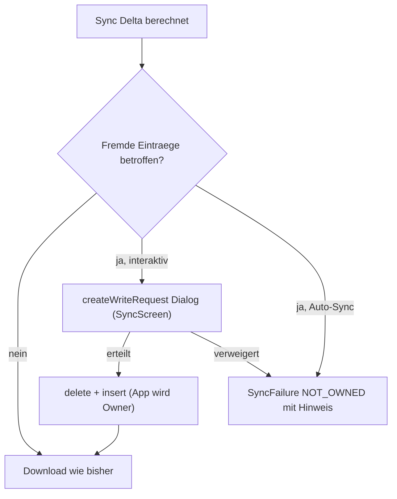

# Plan: Sieben Findings — Sync-Zugriff, Voll-Export, Cast, Rotation, Navigation, Playback-Persistenz, Android Auto

Stand: 2026-07-17, umgesetzt (Branch `work/findings-sync-export-cast-ui`); Build grün,
Installation + Smoke-Test am Pixel 8 Pro OK. Offen: funktionale Geräteverifikation
der einzelnen Findings (siehe STATUS.md → „Offen").

## Todos

- [x] `LocalTrack` um `isOwnedByApp` erweitern (`OWNER_PACKAGE_NAME` in `listLocal`)
- [x] Write-Request-Flow: Callback in `SyncEngine`, `SyncState.AwaitWriteAccess` in `SyncManager`, IntentSender-Launcher in `SyncScreen`
- [x] Fremde Einträge nach Grant per delete+insert überschreiben (App wird Owner); Auto-Sync ohne Grant → `NOT_OWNED`-Failure
- [x] `classifyFailure`: `SecurityException` → `NOT_OWNED`, displayText mit Handlungsanweisung
- [x] ConfigExport v2: Equalizer- und Debug-Felder (nullable), Version 1+2 im parse akzeptieren
- [x] `ConfigExporter` export/apply erweitern; `EqualizerManager.applyImported` für laufende Session
- [x] Cast: Player-State (MediaItems, Index, Position, playWhenReady) beim Session-Wechsel in beide Richtungen übertragen
- [x] Rotation: Portrait-Lock für `MainActivity` im Manifest
- [x] Navigation: Nested-Routen beim Tab-Wechsel poppen statt restore'n
- [x] Playback-State (Queue-IDs, Index, Position) in DataStore persistieren (Transition/Pause/onDestroy)
- [x] Restore: `onPlaybackResumption` im Service + Queue-Wiederherstellung ohne Auto-Play beim Service-Start
- [x] Android Auto: Browse-Baum startet im konfigurierten Startverzeichnis (`library_root`) statt an der Wurzel
- [x] Doku (STATUS/PLAN) aktualisieren, Gradle-Build + Lint als Validierung
- [ ] Geräteverifikation der Findings (Sync-Grant, Cast-Übernahme, EQ-Export, letzter Titel, Android Auto)

## Teil 1: Sync — „has no access to content://media/…"

**Ursache:** [SyncEngine.kt](../android/app/src/main/java/de/schliemannosaurusrex/mukkeklopper/sync/SyncEngine.kt) überschreibt bestehende Einträge (Z. 285–303) ohne Ownership-Prüfung. Ist die App nicht Owner (Neuinstallation, fremd abgelegte Datei), wirft Android eine `SecurityException`. Der Sync-Pfad hat — anders als der Library-Move (`MediaStoreRepository.moveTracks`, nutzt `createWriteRequest`) — keinen Grant-Mechanismus.

### Änderungen

1. **Ownership erfassen:** In `listLocal()` die Spalte `OWNER_PACKAGE_NAME` mitladen, `LocalTrack` um `isOwnedByApp: Boolean` erweitern.
2. **Write-Request-Flow (interaktiver Sync):** Nach der Delta-Berechnung in `sync()` alle fremd-eigenen URIs sammeln, die überschrieben (in `toDownload` mit existing) oder gelöscht (`stale`) werden sollen. Bei nicht-leerer Liste:
   - Neuer Callback `requestWriteAccess: suspend (List<Uri>) -> Boolean` analog zu `confirmDeletions`.
   - `SyncManager` erzeugt `MediaStore.createWriteRequest(...)` und publiziert einen neuen State `SyncState.AwaitWriteAccess(intentSender)`; Ergebnis via `CompletableDeferred` (Muster von `awaitDeletionDecision`, [SyncManager.kt](../android/app/src/main/java/de/schliemannosaurusrex/mukkeklopper/sync/SyncManager.kt) Z. 104–111).
   - [SyncScreen.kt](../android/app/src/main/java/de/schliemannosaurusrex/mukkeklopper/ui/SyncScreen.kt) startet den IntentSender per `rememberLauncherForActivityResult(StartIntentSenderForResult)` — gleiches Muster wie in `LibraryScreen.kt` Z. 96–114.
3. **Self-Healing beim Überschreiben:** Fremde bestehende Einträge nach erteiltem Grant nicht in-place updaten, sondern **delete + insert** — dadurch wird die App Owner und künftige Syncs (auch Auto-Sync) brauchen keinen Grant mehr.
4. **Auto-Sync (nicht interaktiv) / Grant verweigert:** Betroffene Tracks überspringen und als `SyncFailure` mit neuem `FailureReason.NOT_OWNED` erfassen (displayText z. B. „No write access to this file — run a manual sync and approve the permission dialog"). Fremde `stale`-Dateien zählen wie bisher als `deletionsPending`.
5. **Klassifikations-Fix:** In [SyncFailure.kt](../android/app/src/main/java/de/schliemannosaurusrex/mukkeklopper/sync/SyncFailure.kt) `classifyFailure` um `is SecurityException -> NOT_OWNED` (bzw. `MEDIASTORE_REJECTED`) erweitern, damit nie wieder „Unknown error" für diesen Fall erscheint.

## Teil 2: Vollständiger Settings-Export (Config v2)

**Lücke:** `equalizer_settings` und `debug_log_enabled` liegen im selben DataStore, fehlen aber in [ConfigExport.kt](../android/app/src/main/java/de/schliemannosaurusrex/mukkeklopper/settings/ConfigExport.kt) und [ConfigExporter.kt](../android/app/src/main/java/de/schliemannosaurusrex/mukkeklopper/settings/ConfigExporter.kt). Alles andere (Server, Network, Library, Sync, Secrets opt-in) ist bereits abgedeckt; `last_sync_report` ist Laufzeit-State und bleibt bewusst draußen.

### Änderungen

1. **Modell erweitern:** `ConfigExport` bekommt `player: PlayerConfig? = null` (enthält `EqualizerSettings`) und `debug: DebugConfig? = null` (`debugLogEnabled`). `CURRENT_VERSION = 2`.
2. **Rückwärtskompatibler Import:** `parse()` akzeptiert Version 1 **und** 2 (`version in 1..CURRENT_VERSION`); die neuen Felder sind nullable mit Default, v1-Dateien parsen also unverändert.
3. **Export:** `ConfigExporter.export` liest zusätzlich `repository.equalizerSettings.first()` und den Debug-Log-Flag.
4. **Import/Apply:** `ConfigExporter.apply` schreibt `setEqualizerSettings(...)` und den Debug-Flag (nur wenn im File vorhanden). Danach den laufenden Player aktualisieren: neue Funktion `EqualizerManager.applyImported(context, settings)` — normalisiert die Band-Levels auf die Gerät-Bandzahl (gleiche Logik wie in `attach()`, [EqualizerManager.kt](../android/app/src/main/java/de/schliemannosaurusrex/mukkeklopper/player/EqualizerManager.kt) Z. 99–103), setzt `_settings` und ruft `applyToEffects`. Aufruf aus `SettingsViewModel.applyImportedConfig`.
5. **Hinweis Geräte-Wechsel:** Band-Anzahl ist geräteabhängig — bei Mismatch werden die Levels beim Anwenden auf 0 zurückgesetzt (bestehendes Verhalten, kein Crash).

## Teil 3: Cast — laufender Titel wird nicht übertragen

**Ursache (analysiert):** In [MukkePlayerService.kt](../android/app/src/main/java/de/schliemannosaurusrex/mukkeklopper/player/MukkePlayerService.kt) (Z. 56–67) hängt `onCastSessionAvailable()` nur `mediaSession.player` auf den `CastPlayer` um — Playlist, Position und `playWhenReady` des laufenden ExoPlayers werden **nicht** übertragen. Der Receiver startet mit leerer Queue → „kein Titel ausgewählt". `CastMediaItemConverter`/`LocalMediaServer` sind korrekt, werden aber mangels Items nie aufgerufen.

### Änderungen

1. **State-Transfer Exo → Cast** in `onCastSessionAvailable()`: MediaItems (`getMediaItemAt`), `currentMediaItemIndex`, `currentPosition`, `playWhenReady` vom ExoPlayer lesen; ExoPlayer pausieren; `castPlayer.setMediaItems(items, index, position)` + `prepare()` + `playWhenReady` setzen; erst dann `mediaSession.player = castPlayer`.
2. **Rücktransfer Cast → Exo** in `onCastSessionUnavailable()`: gleiches Muster rückwärts, damit die Wiedergabe lokal nahtlos weiterläuft.
3. Gemeinsame Hilfsfunktion `transferPlayback(from: Player, to: Player)` im Service.
4. Auch den Startpfad in `setUpCastPlayer()` (Session bereits aktiv beim Service-Start, Z. 232–234) über denselben Transfer führen.

## Teil 4: Rotation — Ansicht beibehalten

**Ursache (analysiert):** `MainActivity` hat keinen Orientation-Lock ([AndroidManifest.xml](../android/app/src/main/AndroidManifest.xml) Z. 34–42); `NowPlayingScreen` nutzt festes 280-dp-Cover ohne Scroll — im Landscape werden die Controls abgeschnitten.

### Änderung

- Wie vom User gewünscht: `android:screenOrientation="portrait"` an der `MainActivity` — die Ansicht bleibt beim Drehen erhalten. Kein Landscape-Layout nötig.

## Teil 5: Navigation — Sub-Ansichten bleiben beim Zurückkehren stehen

**Ursache (analysiert):** [MukkeKlopperApp.kt](../android/app/src/main/java/de/schliemannosaurusrex/mukkeklopper/ui/MukkeKlopperApp.kt) navigiert Tabs mit `saveState = true`/`restoreState = true` (Z. 27–32). Nested-Routen (`equalizer`, `queue`, `sync_failures`, `debug_log`) werden dadurch beim Rückkehr-Tab-Klick mit wiederhergestellt — man landet z. B. wieder im Debug-Log statt in den Settings.

### Änderungen

1. **Nested-Routen beim Tab-Wechsel verwerfen:** In `navigateToTab` vor dem `navigate` alle Non-Tab-Routen vom Back-Stack poppen (bzw. `popUpTo` so setzen, dass Nested-Einträge nicht im gespeicherten State landen). Tab-Klick führt damit immer auf die Tab-Root; Scroll-Position der Tab-Roots bleibt über `saveState` erhalten.
2. **Nicht anfassen:** Der Library-Ordnerpfad (`LibraryViewModel.currentPath`) bleibt bewusst erhalten — das ist Position innerhalb des Tabs, kein gestapeltes Sub-Menü. Falls unerwünscht, separat entscheiden.

## Teil 6: Zuletzt abgespielter Titel wird nicht gespeichert

**Ursache (analysiert):** Es gibt keinerlei Playback-Persistenz. [MukkePlayerService.kt](../android/app/src/main/java/de/schliemannosaurusrex/mukkeklopper/player/MukkePlayerService.kt) baut den ExoPlayer in `onCreate()` leer auf, überschreibt `onPlaybackResumption` nicht und speichert in `onDestroy()` nichts; im DataStore existiert kein Key für den letzten Titel. Nach App-/Service-Neustart ist die Queue leer.

### Änderungen

1. **Persistieren:** Neuer DataStore-Key `playback_state` (JSON, `@Serializable data class PlaybackState(trackIds: List<Long>, currentIndex: Int, positionMs: Long)`) in `SettingsRepository`. Der Service schreibt ihn über einen `Player.Listener` bei `onMediaItemTransition` und `onIsPlayingChanged(false)` (Position drosselnd, kein Schreiben pro Tick) sowie in `onDestroy()`.
2. **Wiederherstellen:**
   - `onPlaybackResumption` in der `MediaLibrarySession.Callback` überschreiben: gespeicherten State laden, Track-IDs gegen die Library auflösen (`ensureLibraryLoaded()` + `trackMediaItem`), als `MediaItemsWithStartPosition` zurückgeben — deckt Media-Button/System-Resumption ab.
   - Beim Service-Start (`onCreate`) die Queue zusätzlich still vorbereiten (`setMediaItems` + `prepare()`, **ohne** `play()`), damit die App-UI nach Neustart direkt den letzten Titel im Player-Tab anzeigt.
3. **Randfälle:** Gelöschte/fehlende Tracks beim Auflösen überspringen; ist nichts mehr auflösbar, State verwerfen. Kein Export dieses States im Config-Backup (Laufzeit-State wie `last_sync_report`).

## Teil 7: Android Auto — Startverzeichnis statt Wurzel

**Befund:** Die App kennt bereits ein markierbares Startverzeichnis (Stern in der Library, Setting `library_root`); die App-UI startet dort. Der Android-Auto-Browse-Baum ignoriert es aber: `onGetLibraryRoot`/`onGetChildren` in [MukkePlayerService.kt](../android/app/src/main/java/de/schliemannosaurusrex/mukkeklopper/player/MukkePlayerService.kt) (Z. 111–136) liefern immer die MediaStore-Wurzel (`ROOT_ID` → Pfad `""`).

### Änderungen

1. **Root auf `library_root` mappen:** In `onGetChildren` (und `onGetItem` für `ROOT_ID`) den Pfad für `ROOT_ID` nicht auf `""`, sondern auf `settingsRepository.settings.first().libraryRoot` auflösen (leer = Wurzel, wie bisher). Damit zeigt Android Auto beim Einstieg direkt den Favoriten-Ordner; Unterordner-Navigation funktioniert unverändert, da alle weiteren `mediaId`s echte Pfade sind. `SettingsRepository` dazu im Service instanziieren (analog `MediaStoreRepository`).
2. **Laufender/letzter Titel:** Wird bereits durch Teil 6 abgedeckt — Android Auto zeigt den aktuell laufenden Titel automatisch in der Now-Playing-Ansicht, und `onPlaybackResumption` liefert nach Neustart den zuletzt gespielten Titel als abspielbare Resumption-Wurzel. Kein zusätzlicher Browse-Eintrag nötig.

## Abschluss

- Doku mitziehen (`STATUS.md`/`PLAN.md`-Vermerke zum Config-Format v2 und zum Sync-Ownership-Verhalten).
- Validierung: Gradle-Build + Lint; kein Test-Setup vorhanden (kein `src/test`).
